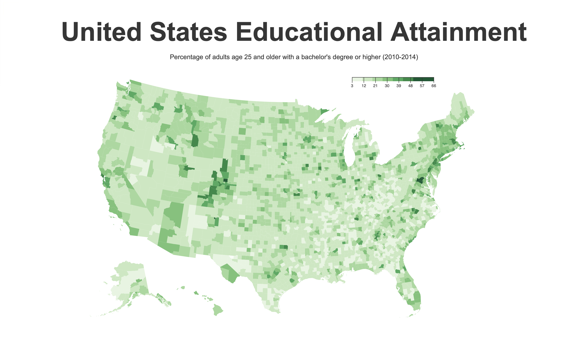

# Choropleth Map With D3
United States Educational Attainment with D3.js

**API URLs**
```javascript
const US_EDUCATION_DATA =
  "https://cdn.freecodecamp.org/testable-projects-fcc/data/choropleth_map/for_user_education.json";
const US_COUNTY_DATA =
  "https://cdn.freecodecamp.org/testable-projects-fcc/data/choropleth_map/counties.json";
```



Open the project in [Codpen](https://codepen.io/Darbaz/pen/rNxEarv)

**Usage**
`npm run dev` to start the dev server